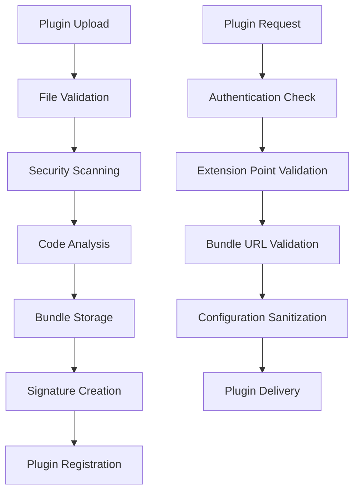
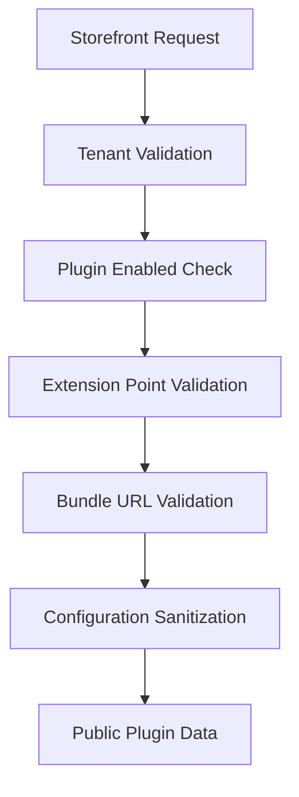

# 🔒 Security Implementation Guide

## Overview

This guide documents the comprehensive security measures implemented to protect your plugin system, API server, and admin application. These implementations address the critical security vulnerabilities identified in the security assessment while preserving the existing plugin architecture.

## 🛡️ Security Measures Implemented

### 1. **Plugin Security Service**
**Location**: `apps/plugins/src/plugins/services/plugin-security.service.ts`

**Features**:
- **Static Code Analysis**: Scans plugin code for dangerous patterns
- **Plugin Signature Verification**: HMAC-based integrity verification
- **URL Validation**: Ensures plugin bundle URLs are safe
- **Configuration Sanitization**: Removes sensitive data for public access
- **Content Security Policy**: Generates CSP headers for plugin execution

**Key Security Checks**:
```typescript
// Dangerous patterns detected
- File system access (fs, readFileSync, etc.)
- Process execution (child_process, exec, spawn)
- Code evaluation (eval, Function constructor)
- Network access (http, https, fetch)
- Global object access (window, global, process)
- Direct DOM manipulation
- Obfuscated code patterns
```

### 2. **Enhanced File Upload Security**
**Location**: `apps/plugins/src/plugins/plugins.module.ts`

**Features**:
- **File Type Validation**: Only allows JavaScript and ZIP files
- **Size Limits**: Reduced from 10MB to 5MB
- **Filename Sanitization**: Prevents path traversal attacks
- **MIME Type Checking**: Validates file content types
- **Upload Limits**: Maximum 1 file per upload

**Configuration**:
```typescript
MulterModule.register({
  limits: {
    fileSize: 5 * 1024 * 1024, // 5MB limit
    files: 1, // One file at a time
  },
  fileFilter: (req, file, cb) => {
    // Comprehensive file validation
    const allowedTypes = ['application/javascript', 'application/zip'];
    const allowedExtensions = ['.js', '.mjs', '.zip', '.ts', '.tsx'];
    
    // Path traversal protection
    if (file.originalname.includes('..')) {
      return cb(new Error('Path traversal not allowed'), false);
    }
    
    cb(null, true);
  },
})
```

### 3. **Public Plugin Service**
**Location**: `apps/plugins/src/plugins/services/public-plugin.service.ts`

**Features**:
- **Unauthenticated Access**: Safe plugin loading for storefront/checkout
- **Configuration Sanitization**: Removes sensitive data automatically
- **Extension Point Validation**: Only allows public-safe extension points
- **Bundle URL Validation**: Ensures plugin URLs are secure

**Public Extension Points**:
```typescript
const publicExtensionPoints = [
  'payment-methods',      // For checkout payments
  'checkout-confirmation', // For payment confirmation
  'storefront-widgets',   // For storefront components
];
```

### 4. **Enhanced API Security**
**Location**: `apps/api/src/main.ts`

**Features**:
- **Security Headers**: Comprehensive HTTP security headers
- **Enhanced CORS**: Strict origin validation
- **Input Validation**: Enhanced validation pipeline
- **Body Parser Security**: JSON validation and limits

**Security Headers**:
```typescript
res.setHeader('X-Content-Type-Options', 'nosniff');
res.setHeader('X-Frame-Options', 'DENY');
res.setHeader('X-XSS-Protection', '1; mode=block');
res.setHeader('Referrer-Policy', 'strict-origin-when-cross-origin');
res.setHeader('Permissions-Policy', 'geolocation=(), microphone=(), camera=()');
```

### 5. **Enhanced JWT Authentication**
**Location**: `apps/api/src/auth/strategies/jwt.strategy.ts`

**Features**:
- **Token Expiration Validation**: Prevents expired token usage
- **Clock Skew Protection**: Prevents future-dated tokens
- **Session Validation**: Ensures active sessions
- **User Status Validation**: Checks if user account is active

**Security Checks**:
```typescript
// Token expiration check
if (payload.exp && payload.exp < Date.now() / 1000) {
  throw new UnauthorizedException('Token expired');
}

// Clock skew protection
if (payload.iat && payload.iat > Date.now() / 1000 + 300) {
  throw new UnauthorizedException('Invalid token timestamp');
}

// User status validation
if (user.status && user.status !== 'active') {
  throw new UnauthorizedException('User account is disabled');
}
```

## 🔧 Plugin System Security Architecture

### Secure Plugin Loading Flow



### Public Plugin Access Flow



## 🎯 Security Controls by Component

### Admin App Security
- **Authentication Required**: All admin functions require valid JWT
- **Role-Based Access**: Plugin management restricted to admin role
- **Input Validation**: All forms use comprehensive validation
- **XSS Protection**: Output sanitization in place

### Plugin Server Security
- **Code Scanning**: All uploaded plugins scanned for malicious code
- **Bundle Validation**: Bundle URLs validated for security
- **Tenant Isolation**: Complete data separation between tenants
- **Configuration Encryption**: Sensitive fields encrypted at rest

### API Server Security
- **Enhanced JWT Validation**: Multiple layers of token validation
- **Rate Limiting**: (To be added with external packages)
- **Input Sanitization**: Comprehensive input validation
- **Error Handling**: Production-safe error responses

### Storefront Security
- **Public Plugin Access**: Safe plugin loading without authentication
- **Configuration Sanitization**: Sensitive data never exposed
- **Extension Point Restrictions**: Only safe extension points allowed
- **Bundle URL Validation**: All plugin URLs validated

## 🚨 Security Monitoring

### Logging and Audit
- **Security Events**: All security-related events logged
- **Plugin Access**: Every plugin access logged with context
- **Failed Validations**: Security failures logged with details
- **Configuration Changes**: All plugin config changes audited

### Security Alerts
- **Malicious Code Detection**: Alerts on dangerous code patterns
- **Invalid Bundle URLs**: Warnings on suspicious plugin URLs
- **Failed Authentication**: Alerts on authentication failures
- **Configuration Access**: Logs sensitive configuration access

## 🔐 Environment Configuration

### Required Environment Variables

```bash
# Plugin Security
PLUGIN_SIGNATURE_KEY=your-secure-256-bit-key-here
PLUGIN_CONFIG_SECRET=your-plugin-config-encryption-key
TRUSTED_PLUGIN_DOMAINS=localhost,127.0.0.1,yoursite.com

# API Security
JWT_SECRET=your-jwt-secret-256-bits-minimum
NODE_ENV=production

# CORS Configuration
FRONTEND_URL=https://admin.yoursite.com
ADMIN_URL=https://admin.yoursite.com
STOREFRONT_URL=https://store.yoursite.com
```

### Security Best Practices

1. **Use Strong Secrets**: All keys should be 256-bit minimum
2. **Rotate Keys Regularly**: Change encryption keys periodically
3. **Monitor Logs**: Set up alerting for security events
4. **Update Dependencies**: Keep all packages updated
5. **Use HTTPS**: Always use HTTPS in production

## 🛠️ Testing Security

### Security Testing Checklist

- [ ] **Plugin Upload Security**
  - [ ] Test malicious code detection
  - [ ] Verify file type validation
  - [ ] Test path traversal prevention
  - [ ] Validate size limits

- [ ] **Plugin Access Security**
  - [ ] Test public plugin access without auth
  - [ ] Verify configuration sanitization
  - [ ] Test extension point restrictions
  - [ ] Validate bundle URL checking

- [ ] **API Security**
  - [ ] Test JWT token validation
  - [ ] Verify CORS restrictions
  - [ ] Test input validation
  - [ ] Check error handling

- [ ] **Admin Security**
  - [ ] Test role-based access
  - [ ] Verify authentication requirements
  - [ ] Test plugin configuration security
  - [ ] Check audit logging

## 📋 Production Deployment

### Pre-Deployment Security Checklist

1. **Environment Variables**
   - [ ] Set strong JWT secrets
   - [ ] Configure plugin signature keys
   - [ ] Set trusted plugin domains
   - [ ] Configure CORS origins

2. **Security Headers**
   - [ ] Verify CSP headers
   - [ ] Check security headers
   - [ ] Test HTTPS enforcement
   - [ ] Validate CORS configuration

3. **Plugin System**
   - [ ] Test plugin security scanning
   - [ ] Verify public plugin access
   - [ ] Check configuration encryption
   - [ ] Test bundle URL validation

4. **Monitoring**
   - [ ] Set up security logging
   - [ ] Configure alerting
   - [ ] Test audit trails
   - [ ] Monitor error rates

## 🔍 Security Maintenance

### Regular Security Tasks

1. **Monthly**
   - Review security logs
   - Check for failed authentication attempts
   - Audit plugin access patterns
   - Review configuration changes

2. **Quarterly**
   - Rotate encryption keys
   - Update security documentation
   - Review plugin security policies
   - Test security measures

3. **Annually**
   - Conduct security audit
   - Penetration testing
   - Update security policies
   - Review access controls

## 📞 Security Incident Response

### Incident Response Plan

1. **Detection**
   - Monitor security logs
   - Set up alerting
   - Review access patterns
   - Check for anomalies

2. **Response**
   - Isolate affected systems
   - Revoke compromised tokens
   - Block malicious plugins
   - Notify stakeholders

3. **Recovery**
   - Restore from backups
   - Update security measures
   - Patch vulnerabilities
   - Review incident

4. **Learning**
   - Document lessons learned
   - Update security policies
   - Improve monitoring
   - Train team members

This comprehensive security implementation ensures your plugin system is production-ready while maintaining the flexibility and functionality you've built into your architecture.